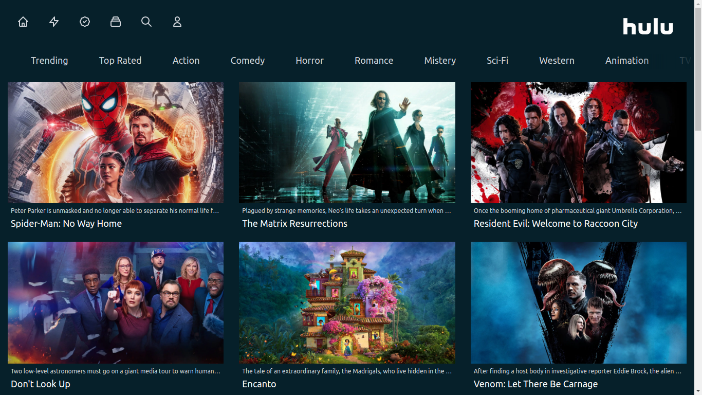
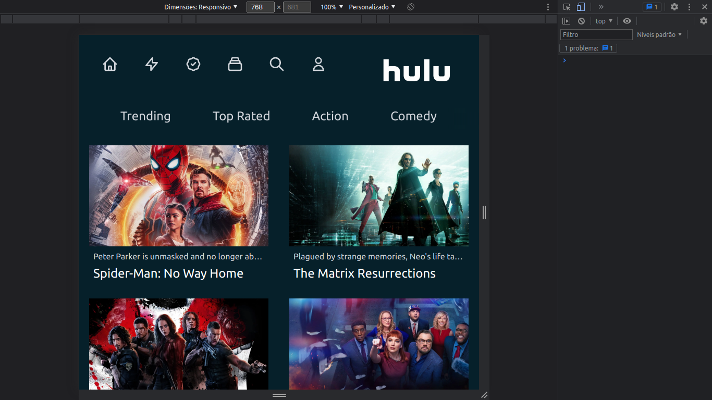
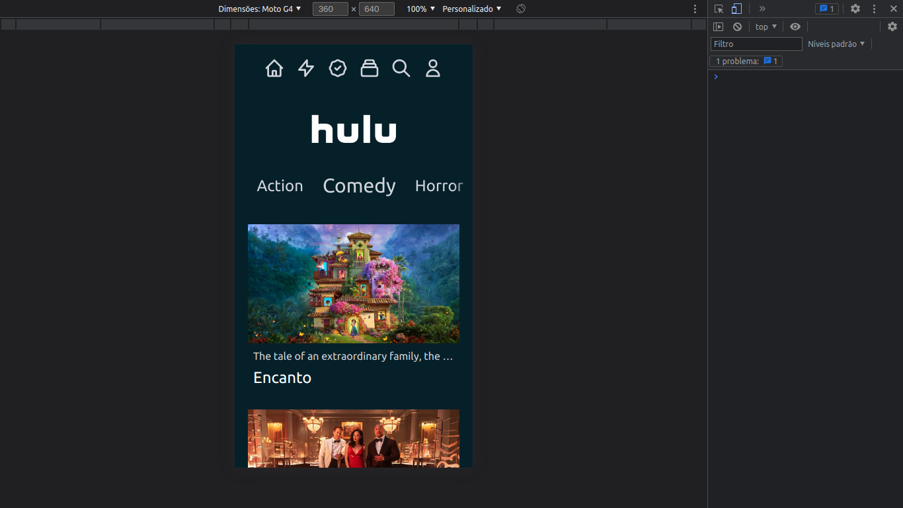

<h2>Hulu 2.0</h2>

Este é um simples projeto usando a api do the movie db, usando react.js, next.js, tailwind css.

 

Após clonar o repositório com <strong>git clone</strong> digite yarn para instalar todas as dependências.

 

Este projeto foi feito com a ideia de mobile-first.

<h4>Desktop</h4>

<h4>Tablet</h4>

<h4>Tablet</h4>
